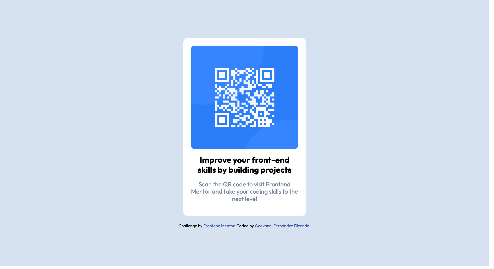

# Frontend Mentor - QR code component solution

This is a solution to the [QR code component challenge on Frontend Mentor](https://www.frontendmentor.io/challenges/qr-code-component-iux_sIO_H). Frontend Mentor challenges help you improve your coding skills by building realistic projects.

## Table of contents

- [Overview](#overview)
  - [Screenshot](#screenshot)
  - [Links](#links)
- [My process](#my-process)
  - [Built with](#built-with)
- [Author](#author)

## Overview

A "QR code card" is a card that features a printed QR code (Quick Response) on its surface. QR codes are two-dimensional matrices that store information such as web links, contact details, or text. Users can scan the QR code with their mobile devices to access the encoded data.

### Screenshot

### Links

- Solution URL: [Frontend Mentor Solution](https://www.frontendmentor.io/solutions/responsive-qr-code-component-html-and-css-T_w-xgQ_Bb)
- Live Site URL: [https://frontendmentor-qr-card-geovanni.netlify.app/](https://frontendmentor-qr-card-geovanni.netlify.app/)

## My process

### Built with

- Semantic HTML5 markup
- CSS custom properties
- BEM methodology
- Mobile-first workflow

## Author

- Frontend Mentor - [@Geovanex24](https://www.frontendmentor.io/profile/Geovanex24)
- Twitter - [@geovanex24](https://www.twitter.com/geovanex24)
